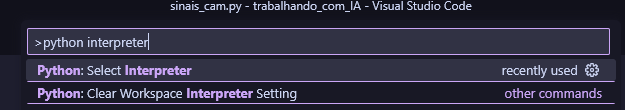
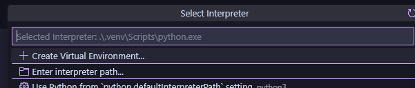
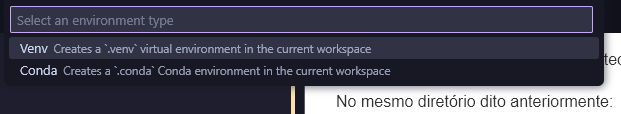
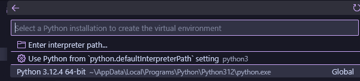
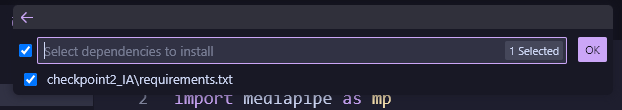

# Como utilizar

## Sobre o projeto
Nos foi dada a missão de utilizar conceitos aprendidos em aula para criar um script em python que fizesse algum tipo de reconhecimento (de mãos, facial ou corporal). Nossa ideia foi inicialmente criar um código que conseguisse reconhecer letras em libras brasileiras (algumas letras), porém ficamos sabendo da data de entrega muito em cima e decidimos reduzir o escopo para reconhecer somente a letra "L".

O projeto foi leve, divertido e trouxe bastante aprendizado para todos do grupo. Esperamos que todos gostem, por mais simples que ele seja! 👆

## Configurando máquina virtual

### Manualmente

Abra o diretório ráiz, obtido pelo clone do github, com o terminal e escreva o seguinte código:

```sh
python -m venv .venv
```

Depois, você precisa instalar as bibliotecas utilizadas no projeto e, para isso, foi deixado um arquivo de **requirements**:

No mesmo diretório dito anteriormente:

```sh
source .venv/Scripts/activate # para ativar a máquina

# agora dentro dela:

pip install -r checkpoint2_IA/requirements.txt # instalando bibliotecas
```

Processo finalizado.

### Com VSCode

Acesse a opção de seleção de interpretador python (dica: utilize Ctrl+Shift+P) para pesquisar:

> Isso deve ser feito com o arquivo **sinais_cam.py** aberto:



Agora vamos seguir com os passos:

1. Selecione "Create Virtual Environment"



2. Selecione **Venv**



3. Selecione a versão de python instalada no seu pc (precisa ser 3+)



4. Instale as bibliotecas automaticamente:



5. Clique em **OK**

Processo finalizado.

## Resultado esperado

Um vídeo se abrirá na sua tela que reconhecerá uma mão e, de acordo com os seus movimentos, dirá se a Letra "L" (em libras brasileiras) foi feita.
